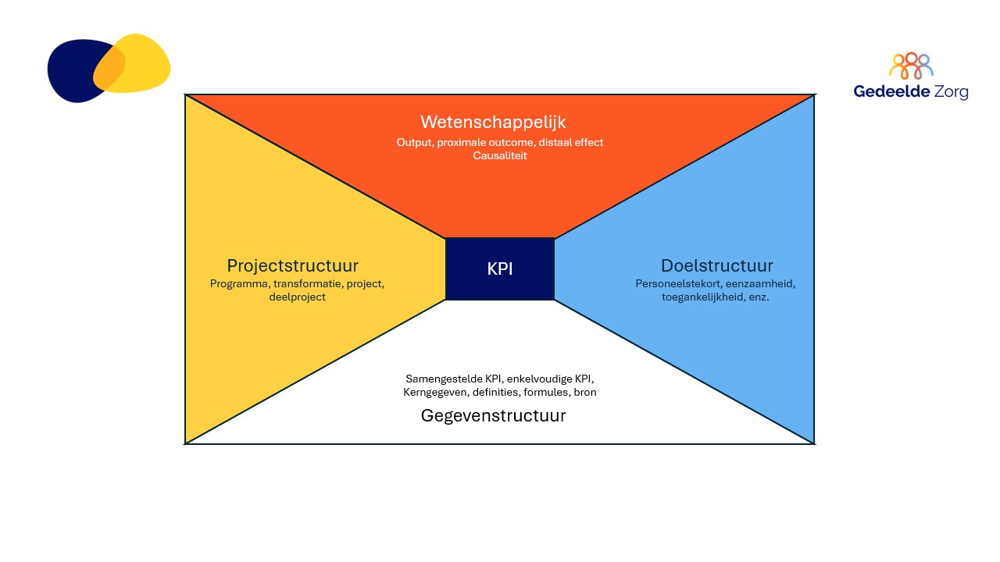

# Home

# Over dit KPI-Framework
# Het transformatieplan in context
# Methodologisch kader
### Input
### Proces
### Output
### Effect
### Impact

  <a href="https://kalungzmh.github.io/KPI-Framework/Bronsystemen%20&%20Data/Overzicht%20gebruikte%20bronsystemen.html" style="
      display: block;
      padding: 15px;
      background-color: #333F81;
      color: white;
      text-decoration: none;
      border-radius: 10px;
      width: 200px;
      height: 100px;
      text-align: center;
  ">
    Overzicht gebruikte bronsystemen
  </a>

  <a href="https://kalungzmh.github.io/KPI-Framework/Bronsystemen%20&%20Data/Gegevensdefinities%20per%20bronsysteem.html" style="
      display: block;
      padding: 15px;
      background-color: #333F81;
      color: white;
      text-decoration: none;
      border-radius: 10px;
      width: 200px;
      height: 100px;
      text-align: center;
  ">
    Gegevensdefinitie per bronsysteem
  </a>

  <a href="https://kalungzmh.github.io/KPI-Framework/Bronsystemen%20&%20Data/Kwaliteit%20en%20betrouwbaarheid%20van%20brondata.html" style="
      display: block;
      padding: 10px;
      background-color: #333F81;
      color: white;
      text-decoration: none;
      border-radius: 10px;
      width: 200px;
      height: 100px;
      text-align: center;
  ">
    Kwaliteit en betrouwbaarheid van brondata
  </a>

